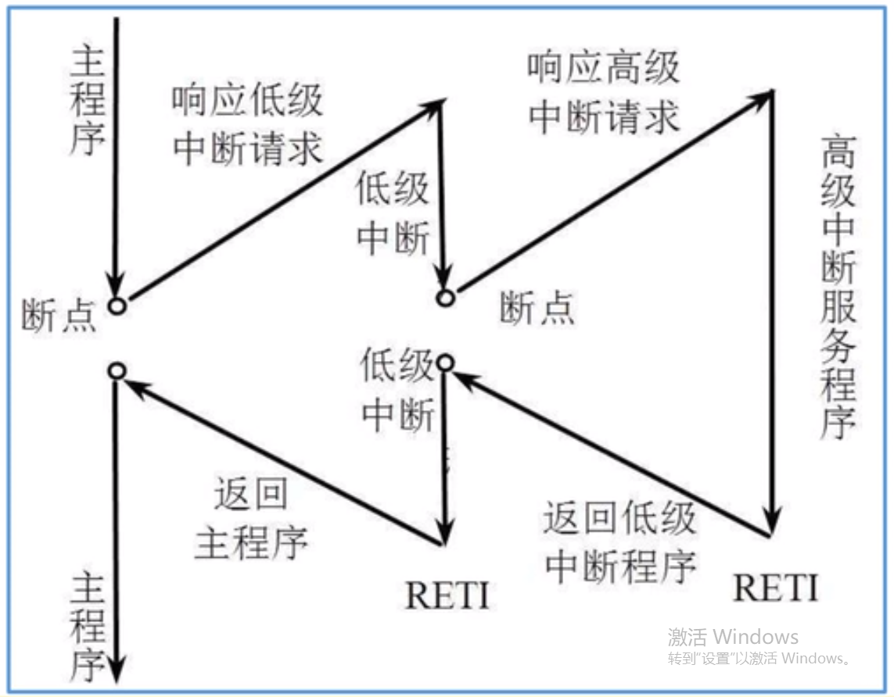
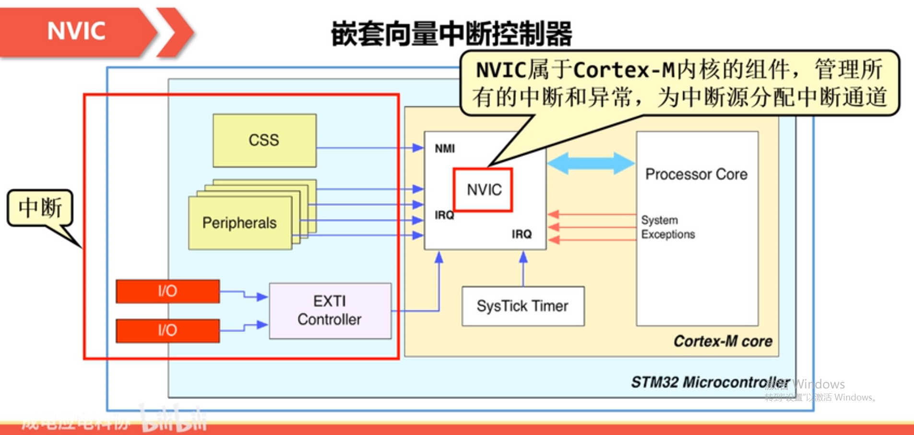
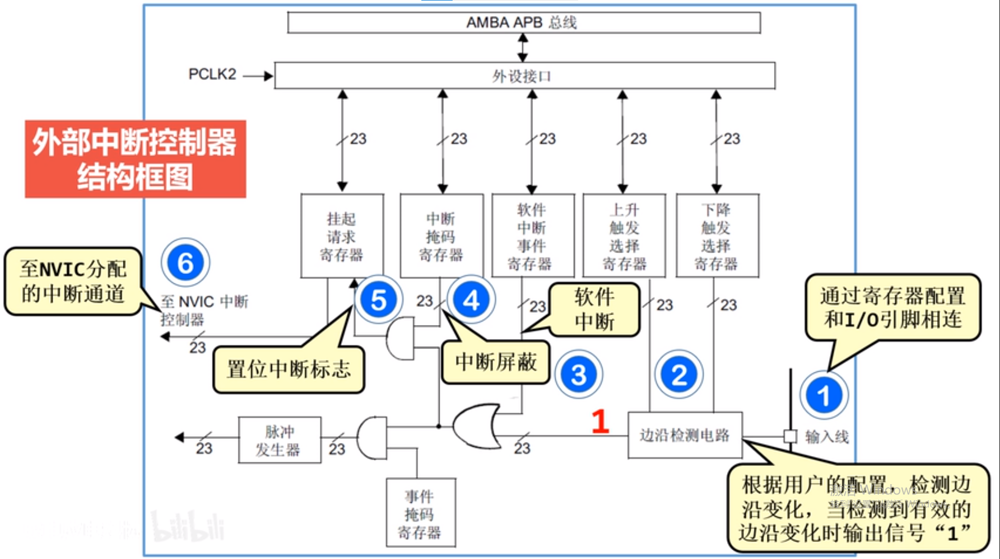

# 中断

## 一、中断的定义

中断是指计算机运行过程中，出现某些意外情况需主机干预时，机器能自动停止正在运行的程序并转入处理新情况的程序，处理完毕后又返回原被暂停的程序继续运行。

## 二、中断的种类

根据中断的出现位置可分为==外部中断==和==内部中断==

根据是否可有程序控制屏蔽可分为==屏蔽中断==和==非屏蔽中断==

根据中断时是否执行查询程序可分为==向量中断==和==非向量中断==

。。。

## 三、中断的意义

1. 速度匹配
2. 分时操作
3. 实时响应
4. 可靠性高

## 四、中断处理流程

①中断源发出中断请求。

②判断当前处理机是否允许中断和该中断源是否被屏蔽。

③优先权排队。

④处理机执行完当前指令或当前指令无法执行完，则立即停止当前程序，保护断点地址和处理机当前状态，转入相应的中断服务程序。

⑤执行中断服务程序。

⑥恢复被保护的状态，执行“中断返回”指令回到被中断的程序或转入其他程序。

## 五、中断在HAL库中

中断 -> 现场入栈 -> 中断服务程序 -> 判断标志位并清零 -> 中断回调函数 -> 还原现场 

NVIC：嵌套向量中断控制器

EXTI: 外部中断

